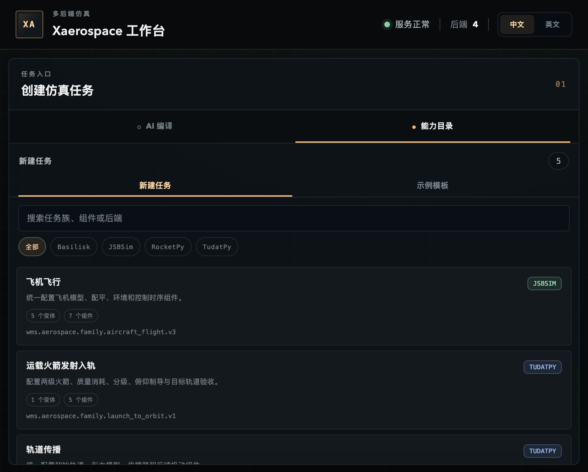

<div align="center">

# XAEROSPACE

**用自然语言编排可信的航空航天仿真**

RocketPy · TudatPy · JSBSim · Basilisk

[中文使用手册](docs/v0.2.1_product_demo_zh.md) ·
[PDF 手册（v0.2.0）](docs/Xaerospace_v0.2.0_使用手册.pdf) ·
[统一协议](docs/unified_io_protocol.md) ·
[Provider 配置](docs/provider_configuration.md)

</div>



## 这是什么

Xaerospace 是一个 LLM-first、verification-backed 的航空航天仿真工作台。
用户可以用一句话描述任务，也可以从参数表单、JSON 合同或参考场景开始。
LLM 负责理解意图和生成合同草案，确定性代码负责 Schema 校验、权限控制、
后端路由和 Fail-closed，最终计算由真实开源物理后端完成。

系统当前统一接入四个后端：

| 后端 | 能力 |
|---|---|
| RocketPy 1.13.0 | 火箭 3DOF/6DOF、飞行事件、降落伞回收 |
| TudatPy 1.0.0 | 二体、J2、阻力轨道传播，两级发射入轨 |
| JSBSim 1.3.1 | 固定翼配平、非线性六自由度、控制响应 |
| Basilisk 2.11.0 | 航天器姿态、MRP 控制、反作用轮动力学 |

不存在备用物理后端。指定后端不可用、合同不受支持或输出未通过约束时，
任务会明确失败，不会切换到简化模型或伪造成功结果。

## 十分钟跑通

### 1. 安装

Xaerospace 支持 Python 3.10 至 3.12，推荐 Python 3.12。

使用 `uv`：

```bash
git clone https://github.com/ASTion24/xaerospace.git Xaerospace
cd Xaerospace
uv sync --extra test --python 3.12
```

使用 `venv` 和 `pip`：

```bash
python3.12 -m venv .venv
source .venv/bin/activate
python -m pip install --upgrade pip
python -m pip install -e ".[test,release]"
```

TudatPy 使用独立 Conda 环境。在 macOS arm64 上运行：

```bash
uv run xaerospace setup-tudatpy
```

### 2. 启动工作台

```bash
uv run xaerospace web
```

浏览器将打开：

```text
http://127.0.0.1:8000
```

若在无图形环境运行：

```bash
uv run xaerospace web --no-browser
```

默认情况下，运行产物和 TudatPy 隔离环境位于
`~/Library/Application Support/Xaerospace/`。可通过 `XAEROSPACE_HOME`
修改整个用户数据根目录，或用 `xaerospace web --runs-dir` 仅修改运行产物目录。
工作流索引和状态保存在该目录的 `workspace.sqlite3`，大型时序结果仍位于
`runs/`。

### 3. 执行第一个任务

1. 在“示例模板”中选择 `单级火箭 3DOF`。
2. 检查自动填充的参数。
3. 点击“添加到工作流”。
4. 点击“执行工作流”。
5. 在结果区查看状态时间轴、事件、指标、方程和图表。

不启动 Web 也可以直接运行：

```bash
xaerospace simulate scenarios/single_stage_demo.json \
  --output outputs/single_stage_demo
```

## 持久任务工作区

已确认执行的工作流会持久保存。服务或浏览器重启后，Studio 可以从“历史”中
重新打开任务队列、结果和导出合同；浏览器刷新会恢复最近查看的工作流。

运行中的任务不会被猜测为成功，也不会自动重试。服务异常停止后，未完成工作流
会明确变为 `interrupted`，由用户检查上下文后决定是否显式重放。结果产物保存
SHA-256，下载前会重新校验；历史中的终态工作流可以由用户确认后删除。

持久层沿用现有 `WorkflowStore` 和文件产物目录，只增加一个本地 SQLite 索引。
DraftSession 仍是短期编辑上下文，不持久化对话全文。

## 一句话到入轨

配置 LLM Provider 后，在 AI 编译区输入：

```text
将 15000 kg 有效载荷由两级运载火箭送入 220 km 近圆轨道
```

系统按以下边界处理：

```text
自然语言
  -> IntentInterpreter
  -> CapabilityMatcher
  -> ContractSynthesizer
  -> 用户检查并确认
  -> 强类型合同编译
  -> TudatPy 两级动力飞行
  -> 入轨后轨道验证
```

LLM 不直接运行仿真，也不能修改锁定字段。只有用户点击“确认合同并执行”后，
服务器才会提交 DraftSession 中的确定版本。

参考任务的真实结果位于 220 km 级近圆轨道，包含两级质量消耗、分级、
俯仰程序、J2、旋转大气阻力和入轨后 1200 秒验证。

## Provider 配置

复制无密钥模板：

```bash
cp config/providers.example.json config/providers.local.json
chmod 600 config/providers.local.json
```

在本地文件中填写 API 地址和模型，将密钥放入环境变量：

```json
{
  "schema_version": 1,
  "active_provider": "cloud",
  "providers": {
    "cloud": {
      "type": "openai_compatible",
      "base_url": "https://your-provider.example/v1",
      "model": "your-model",
      "api_key_env": "XAEROSPACE_PROVIDER_API_KEY",
      "compatibility_mode": "strict"
    }
  }
}
```

```bash
export XAEROSPACE_PROVIDER_API_KEY="..."
xaerospace web --provider-profile cloud
```

`config/providers.local.json` 与 `config/providers.*.local.json` 已被 Git
忽略。不要把 API 密钥、私有地址或组织 Header 写入可提交文件。

当前内部仍兼容 `WMS_*` 环境变量和 `wms-aerospace` 命令，便于旧配置迁移。
新项目和文档统一使用 `Xaerospace` 品牌与 `xaerospace` 命令。

## 能力目录

五个任务族提供十六个真实后端变体：

| 任务族 | 变体 |
|---|---|
| `rocket_flight` | 3DOF、3DOF 回收、6DOF、6DOF 回收 |
| `launch_to_orbit` | 两级 220 km 级近圆轨道参考任务 |
| `orbit_propagation` | 二体、J2、J2 加大气阻力 |
| `aircraft_flight` | C172P、C172R、C182、C310、J3 Cub |
| `spacecraft_gnc` | 惯性指向、无控制对照、角速度阻尼 |

仓库内包含十七个可直接运行的参考场景。它们是强类型合同的示例，
不是写死的演示轨迹；在对应 Schema 允许范围内修改参数即可生成新任务。

## 统一输出

每次仿真返回同一版本化边界：

- 共享时间轴；
- 带单位、物理量和坐标系的状态通道；
- 事件与归一化指标；
- 后端名称、版本和模型清单；
- 动力学方程、参数、假设和局限；
- JSON、CSV、Markdown 和 PNG 产物；
- Assistant 来源与工作流审计信息。

后端原生对象不会穿过统一协议。未知、冲突或模糊的后端选择会直接失败。

## 常用命令

启动 Web：

```bash
xaerospace web
```

选择 Provider：

```bash
xaerospace web \
  --provider-config config/providers.local.json \
  --provider-profile cloud
```

执行场景：

```bash
xaerospace simulate scenarios/earth_orbit_j2_demo.json \
  --output outputs/earth_orbit_j2_demo
```

执行 Assistant 评测：

```bash
xaerospace assistant-eval \
  --provider-profile cloud \
  --output outputs/assistant_eval
```

重放已导出的请求：

```bash
xaerospace simulate outputs/single_stage_demo/request.json \
  --output outputs/replayed_single_stage
```

## 架构

```text
用户输入
  -> IntentIR / 参数表单 / JSON 合同
  -> TaskFamilyRegistry
  -> BackendRegistry
  -> RocketPy | TudatPy | JSBSim | Basilisk
  -> WorkflowStore + SQLite durable index
  -> UnifiedSimulationResult
  -> 状态 / 事件 / 指标 / 方程 / 图表 / 审计产物
```

跨后端任务使用显式状态交接协议。当前支持 RocketPy 飞行结果向 TudatPy
轨道状态的强类型转换，并记录源状态、目标状态、单位、坐标系和转换依据。

## 开发验证

运行测试：

```bash
python -m pytest
```

静态检查：

```bash
python -m ruff check .
```

完整物理与打包门禁：

```bash
python scripts/release_gate.py
```

完整门禁需要 RocketPy、TudatPy、JSBSim 和 Basilisk 均可用。

从 Markdown 重新生成 PDF 使用手册：

```bash
uv sync --extra docs --python 3.12
uv run python scripts/build_manual_pdf.py
```

构建器会执行双遍分页、目录页码回填、中文字体嵌入、图表固化和 PDF
版面验收。macOS 需要安装 Google Chrome，并使用系统自带的
Hiragino Sans GB、Avenir Next 和 Menlo。

## 安全边界

- Studio 只允许绑定 `127.0.0.1`、`localhost` 或 `::1`，不提供未经认证的
  局域网服务。
- LLM 只能提交结构化草案，不能直接执行。
- 用户必须显式确认当前 revision。
- Provider 失败不会回退到另一个未选择的 Provider。
- 后端失败不会回退到另一套物理模型。
- 中断任务不会自动恢复或自动重试。
- 运行产物在下载前执行 SHA-256 完整性校验。
- 本地 Provider 配置不会进入 Git 或 wheel。
- 本项目不是飞行认证、任务安全分析或真实制导控制软件。

## 文档

- [完整中文使用手册](docs/v0.2.1_product_demo_zh.md)
- [PDF 使用手册（v0.2.0）](docs/Xaerospace_v0.2.0_使用手册.pdf)
- [Provider 配置](docs/provider_configuration.md)
- [统一输入输出协议](docs/unified_io_protocol.md)
- [两级发射入轨](docs/two_stage_launch_to_orbit.md)
- [跨后端状态交接](docs/cross_backend_handover.md)

## License

Xaerospace 以 MIT License 发布。各物理后端仍遵循各自许可证。
