<div align="center">
  <p><strong>XAEROSPACE</strong></p>
  <p>INTELLIGENCE COMPILES · PHYSICS VERIFIES</p>
</div>

# Xaerospace v0.1.2 使用手册

> [!IMPORTANT]
> 本手册只围绕用户任务展开：安装、配置、运行、查看结果和排查错误。
> 文中的界面截图与物理图表均来自真实运行。Xaerospace 不会用简化模型
> 冒充指定后端，也不会在失败时伪造成功结果。

## 从这里开始

| 你想完成的任务 | 直接阅读 |
|---|---|
| 第一次启动并跑通一个 Demo | [第 4 章：安装与启动](#4-安装与启动) |
| 用一句话生成发射入轨任务 | [第 9 章：一句话完成两级发射入轨](#9-demo-5一句话完成两级发射入轨) |
| 配置任意 OpenAI-compatible API | [第 3 章：Provider 系统](#3-v012-provider-系统) |
| 手动运行火箭、轨道、飞机或姿态任务 | [第 10～11 章](#10-demo-6不用-llm-手动运行火箭) |
| 查看方程、模型与真实结果 | [第 12 章：查看动力学方程](#12-demo-8查看动力学方程) |
| 调用 HTTP API 或 CLI | [第 17～18 章](#17-常用-api) |
| 任务失败或 Provider 不可用 | [第 19～22 章](#19-provider-fail-closed) |

最快启动路径：

```bash
uv sync --extra test --python 3.12
uv run xaerospace setup-tudatpy
uv run xaerospace web
```

浏览器打开 `http://127.0.0.1:8000` 后，从“示例模板”选择任务，添加到工作流，
再点击“执行工作流”。自然语言功能需要额外配置 Provider，手动任务不需要。

## 1. 系统全景


界面包含：

- 左侧：AI 编译、能力目录、示例模板；
- 中间：任务变体、中文参数表单、高级 JSON；
- 右侧：任务队列、执行状态、结果、模型方程和产物。

v0.1.2 的完整数据流：

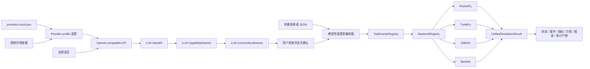

职责边界：

- LLM 负责语义理解、能力匹配和合同草案；
- Provider 层负责结构化 API 通信、超时、并发、健康检查和熔断；
- 确定性代码负责 Schema、字段权限、物理后端路由和 Fail-closed；
- 物理后端负责真实动力学传播；
- 用户负责在执行前检查并确认合同。

## 2. 功能能力

### 2.1 真实物理后端

| 后端 | 固定版本 | 主要能力 |
|---|---:|---|
| RocketPy | 1.13.0 | 单级火箭 3DOF/6DOF、事件、推力曲线和降落伞回收 |
| TudatPy | 1.0.0 | 二体/J2/阻力轨道、两级发射、质量传播和入轨验证 |
| JSBSim | 1.3.1 | 固定翼配平、非线性六自由度和控制面响应 |
| Basilisk | 2.11.0 | 航天器刚体姿态、MRP 控制和反作用轮动力学 |

没有备用物理后端。指定后端不可用时任务失败，不会换成自研简化模型。

### 2.2 任务族与变体

| 任务族 | 变体数 | 变体 |
|---|---:|---|
| `rocket_flight` | 4 | 3DOF、3DOF 回收、6DOF、6DOF 回收 |
| `launch_to_orbit` | 1 | 两级 220 km 级近圆轨道参考任务 |
| `orbit_propagation` | 3 | 二体、J2、J2 加大气阻力 |
| `aircraft_flight` | 5 | C172P、C172R、C182、C310、J3 Cub |
| `spacecraft_gnc` | 3 | 惯性指向、无控制对照、角速度阻尼 |
| **合计** | **16** | **4 个真实后端** |

完整变体清单：

| 任务族 | 变体 ID | 动力学任务 | 主要模型 |
|---|---|---|---|
| `rocket_flight` | `point_mass_3dof` | `single_stage_point_mass_3dof` | 质点三自由度完整飞行 |
| `rocket_flight` | `point_mass_3dof_recovery` | `single_stage_point_mass_3dof_recovery` | 三自由度飞行与降落伞回收 |
| `rocket_flight` | `rigid_body_6dof` | `single_stage_rigid_body_6dof` | 刚体六自由度、四元数和气动力矩 |
| `rocket_flight` | `rigid_body_6dof_recovery` | `single_stage_rigid_body_6dof_recovery` | 六自由度上升与双伞回收 |
| `launch_to_orbit` | `two_stage_220km_reference` | `two_stage_launch_to_orbit` | 两级动力、分级、质量传播和轨道注入 |
| `orbit_propagation` | `earth_two_body` | `earth_orbit_two_body` | 地球点质量二体轨道 |
| `orbit_propagation` | `earth_j2` | `earth_orbit_j2` | 地球 J2 非球形引力 |
| `orbit_propagation` | `earth_j2_aerodynamic_drag` | `earth_orbit_j2` | J2、指数大气和旋转大气阻力 |
| `aircraft_flight` | `c172p_trimmed_6dof` | `fixed_wing_trimmed_6dof` | Cessna 172P 配平六自由度 |
| `aircraft_flight` | `c172r_trimmed_6dof` | `fixed_wing_trimmed_6dof` | Cessna 172R 配平六自由度 |
| `aircraft_flight` | `c182_trimmed_6dof` | `fixed_wing_trimmed_6dof` | Cessna 182 配平六自由度 |
| `aircraft_flight` | `c310_trimmed_6dof` | `fixed_wing_trimmed_6dof` | Cessna 310 双发配平六自由度 |
| `aircraft_flight` | `j3cub_trimmed_6dof` | `fixed_wing_trimmed_6dof` | Piper J3 Cub 配平六自由度 |
| `spacecraft_gnc` | `inertial_pointing_rw` | `spacecraft_inertial_pointing_gnc` | MRP 惯性指向与三反作用轮 |
| `spacecraft_gnc` | `uncontrolled_attitude_rw` | `spacecraft_inertial_pointing_gnc` | 同初值无控制物理对照 |
| `spacecraft_gnc` | `reaction_wheel_rate_damping` | `spacecraft_rate_damping_gnc` | 反作用轮角速度阻尼 |

任务族 Schema：

| 任务族 | Family Schema | Contract Schema |
|---|---|---|
| `rocket_flight` | `wms.aerospace.family.rocket_flight.v3` | `wms.aerospace.scenario.v1` |
| `launch_to_orbit` | `wms.aerospace.family.launch_to_orbit.v1` | `wms.aerospace.launch_to_orbit.v1` |
| `orbit_propagation` | `wms.aerospace.family.orbit_propagation.v2` | `wms.aerospace.orbit_propagation.v2` |
| `aircraft_flight` | `wms.aerospace.family.aircraft_flight.v3` | `wms.aerospace.aircraft_flight.v1` |
| `spacecraft_gnc` | `wms.aerospace.family.spacecraft_gnc.v3` | `wms.aerospace.spacecraft_attitude.v1` |

17 个参考场景：

| 场景文件 | 任务族 / 变体 |
|---|---|
| `single_stage_demo.json` | `rocket_flight / point_mass_3dof` |
| `single_stage_point_mass_recovery_demo.json` | `rocket_flight / point_mass_3dof_recovery` |
| `single_stage_6dof_demo.json` | `rocket_flight / rigid_body_6dof` |
| `single_stage_6dof_recovery_demo.json` | `rocket_flight / rigid_body_6dof_recovery` |
| `two_stage_220km_launch_demo.json` | `launch_to_orbit / two_stage_220km_reference` |
| `earth_orbit_two_body_demo.json` | `orbit_propagation / earth_two_body` |
| `earth_orbit_j2_demo.json` | `orbit_propagation / earth_j2` |
| `earth_orbit_j2_drag_demo.json` | `orbit_propagation / earth_j2_aerodynamic_drag` |
| `c172p_trimmed_cruise_demo.json` | `aircraft_flight / c172p_trimmed_6dof` |
| `c172p_aileron_pulse_demo.json` | `aircraft_flight / c172p_trimmed_6dof` |
| `c172r_trimmed_cruise_demo.json` | `aircraft_flight / c172r_trimmed_6dof` |
| `c182_trimmed_cruise_demo.json` | `aircraft_flight / c182_trimmed_6dof` |
| `c310_trimmed_cruise_demo.json` | `aircraft_flight / c310_trimmed_6dof` |
| `j3cub_trimmed_cruise_demo.json` | `aircraft_flight / j3cub_trimmed_6dof` |
| `spacecraft_attitude_gnc_demo.json` | `spacecraft_gnc / inertial_pointing_rw` |
| `spacecraft_attitude_uncontrolled_demo.json` | `spacecraft_gnc / uncontrolled_attitude_rw` |
| `spacecraft_rate_damping_demo.json` | `spacecraft_gnc / reaction_wheel_rate_damping` |

参考场景是可运行 starter，不是系统能力上限。在同一变体 Schema 内修改允许参数
会形成新的强类型任务。

### 2.3 参数系统

当前服务器参数目录包含：

```text
23 个参数分组
114 个字段定义
中英文名称和解释
SI 单位
允许范围
基础/高级参数分层
推荐修改标记
```

参数定义来自服务器单一事实源。前端不维护另一份独立范围表。

### 2.4 工作流

支持：

- 最多 12 个有序任务；
- 单工作线程 Fail-closed 执行；
- 上游失败后停止依赖任务；
- RocketPy 到 TudatPy 的显式状态交接；
- `wms.aerospace.workflow.v1` 导出；
- 显式 `confirmed=true` 重放；
- 新 workflow ID 和独立结果产物。

### 2.5 结果可观测性

每个任务提供：

- 统一时间轴；
- 带单位和坐标系的状态通道；
- 物理事件；
- 归一化指标；
- 后端和版本来源；
- 状态变量与动力学方程；
- 模型参数、假设和局限；
- CSV、JSON、Markdown 和 PNG 产物。

### 2.6 RocketPy 火箭模型

三自由度模型计算：

- 本地 East-North-Up 平动状态；
- 变质量推力；
- 轴向阻力；
- 标准大气和重力；
- 发射导轨约束；
- 离轨、燃尽、最高点和撞地事件。

六自由度模型增加：

- 四元数姿态；
- 机体系角速度；
- 箭体和发动机时变惯量；
- 头锥、梯形翼、尾段和导轨按钮；
- 气动力和气动力矩；
- 平动与转动耦合。

回收模型增加：

- 最高点或高度触发；
- 采样触发逻辑；
- 部署延时；
- 阻力面积和附加质量；
- 减速伞与主伞事件；
- 着陆速度验收。

### 2.7 两级发射入轨模型

参考任务从地面状态开始，按时间顺序传播：

```text
发射
-> 一级动力飞行和质量消耗
-> 一级关机
-> 一级分离质量跃变
-> 二级点火
-> 二级动力飞行和质量消耗
-> 二级关机
-> 轨道注入
-> 1200 秒无动力轨道验证
```

力模型包括：

- 地球中心引力；
- J2 非球形引力；
- 旋转指数大气；
- 气动阻力；
- 预设俯仰程序推力方向；
- 推力对应的质量流率。

传播器联合积分平动状态和质量状态。系统不使用预生成轨迹，也不在失败时切换到
预置在轨初值。

### 2.8 TudatPy 轨道模型

三种变体分别启用：

- 点质量地球二体引力；
- J2 球谐引力；
- J2、指数大气和相对旋转大气阻力。

输出包括 J2000 笛卡尔状态、轨道高度、半长轴、偏心率、倾角、升交点赤经、
比能和比角动量。二体任务检查守恒，J2 任务检查短周期变化和升交点回归，阻力
任务检查轨道能量损失和半长轴下降。

### 2.9 JSBSim 飞机模型

固定翼任务使用：

- WGS84 地球；
- 1976 U.S. Standard Atmosphere；
- JSBSim 内置飞机 XML；
- 活塞-螺旋桨推进；
- 非线性刚体六自由度；
- 纵向配平；
- 相对配平值的显式控制时序。

支持 C172P、C172R、C182、C310 和 J3 Cub。控制段可以施加副翼、升降舵、
方向舵和油门变化，输出姿态、空速、高度、航向、侧滑、载荷因子和机体角速度。

### 2.10 Basilisk 航天器姿态与 GNC

姿态任务集成：

- 刚体 hub 动力学；
- MRP 姿态运动学；
- 三个反作用轮；
- 完美姿态导航；
- 惯性固定参考姿态；
- MRP tracking error；
- PD/MRP 反馈；
- 最小范数轮力矩分配；
- 轮力矩饱和、轮速和角动量。

`reaction_wheel_rate_damping` 将姿态增益设为零，只声明角速度阻尼。
`uncontrolled_attitude_rw` 使用相同初值提供无控制对照，防止把自然衰减误判为
控制器成功。

## 3. v0.1.2 Provider 系统

> [!NOTE]
> `WMS_ASSISTANT_*`、`WMS_PROVIDER_*` 和 `~/.config/wms-aerospace/`
> 是 v0.1.2 保留的兼容标识。它们不会改变公开品牌名称，也不应被写入密钥值。
> 新的启动命令统一使用 `xaerospace`。

### 3.1 多 API profile

一个版本化 JSON 可以管理多个 API，并在启动时选择其中一个：

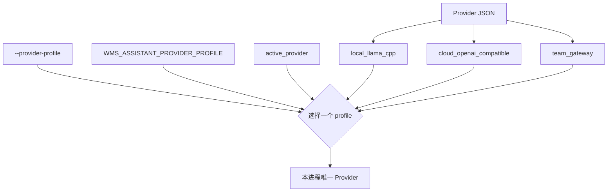

只选择一个 profile。该 profile 失败时不会尝试其他 API。

### 3.2 当前支持的 API 范围

内置 Provider 类型：

```text
openai_compatible
```

可以配置：

- 任意 HTTP(S) `base_url`；
- 任意模型 ID；
- `/chat/completions` 或自定义生成路径；
- `/models` 或自定义模型发现路径；
- Bearer Token；
- `X-API-Key` 等环境变量驱动的 Header；
- `strict` 或 `llama_cpp` Schema 兼容模式；
- 超时、并发、最大输出 Token；
- 健康缓存和熔断参数。

非 OpenAI-compatible 协议需要新增明确适配器，系统不会猜测 API 格式。

### 3.3 配置文件边界

可提交模板：

```text
config/providers.example.json
```

本地真实配置：

```text
config/providers.local.json
config/providers.<name>.local.json
```

本地配置已经写入 `.gitignore`。当前工作区的初始配置：

```text
profile: previous_glm
permissions: 0600
```

真实地址和密钥只保存在本地配置或环境变量中。

### 3.4 密钥策略

配置文件只能写密钥环境变量名称：

```json
{
  "api_key_env": "WMS_PROVIDER_API_KEY"
}
```

真实值只在进程环境中设置：

```bash
export WMS_PROVIDER_API_KEY="..."
```

Schema 明确拒绝：

```json
{
  "api_key": "plaintext-secret"
}
```

### 3.5 Provider JSON 完整结构

```json
{
  "schema_version": 1,
  "active_provider": "cloud",
  "providers": {
    "cloud": {
      "type": "openai_compatible",
      "base_url": "https://api.example.invalid/v1",
      "model": "replace-with-model-id",
      "api_key_env": "WMS_PROVIDER_API_KEY",
      "header_env": {
        "X-Organization": "WMS_PROVIDER_ORGANIZATION"
      },
      "chat_completions_path": "/chat/completions",
      "models_path": "/models",
      "compatibility_mode": "strict",
      "timeout_s": 45,
      "max_concurrency": 1,
      "health_timeout_s": 10,
      "health_ttl_s": 30,
      "max_output_tokens": 1024,
      "circuit_failure_threshold": 3,
      "circuit_cooldown_s": 60
    }
  }
}
```

顶层字段：

| 字段 | 必填 | 说明 |
|---|---|---|
| `schema_version` | 是 | 当前必须为 `1` |
| `active_provider` | 是 | 未被 CLI 或环境变量覆盖时使用的 profile |
| `providers` | 是 | 1 至 32 个命名 profile |

profile 字段：

| 字段 | 必填 | 默认值 | 约束和含义 |
|---|---|---|---|
| `type` | 是 | - | 当前只接受 `openai_compatible` |
| `base_url` | 是 | - | 绝对 HTTP(S) URL，不能含账号密码、query 或 fragment |
| `model` | 是 | - | API 使用的模型 ID |
| `api_key_env` | 否 | - | Bearer Token 的环境变量名称 |
| `header_env` | 否 | `{}` | Header 名到环境变量名称的映射，最多 16 个 |
| `chat_completions_path` | 否 | `/chat/completions` | 结构化生成路径，可带非敏感 query |
| `models_path` | 否 | `/models` | 健康检查和模型发现路径 |
| `compatibility_mode` | 否 | `strict` | `strict` 或 `llama_cpp` |
| `timeout_s` | 否 | `45` | 单次生成超时，范围 1 至 600 秒 |
| `max_concurrency` | 否 | `1` | 最大并发，范围 1 至 8 |
| `health_timeout_s` | 否 | `10` | 健康检查超时，范围 1 至 30 秒 |
| `health_ttl_s` | 否 | `30` | 健康结果缓存，范围 0 至 600 秒 |
| `max_output_tokens` | 否 | `1024` | 输出上限，范围 128 至 16384 |
| `circuit_failure_threshold` | 否 | `3` | 熔断前连续失败数，范围 1 至 10 |
| `circuit_cooldown_s` | 否 | `60` | 熔断冷却，范围 1 至 600 秒 |

profile 名称只允许字母、数字、点、下划线和连字符，最长 64 个字符。

### 3.6 配置发现和选择优先级

配置文件按以下顺序选择：

```text
1. CLI --provider-config
2. WMS_ASSISTANT_PROVIDER_CONFIG
3. 当前目录/config/providers.local.json
4. 项目目录/config/providers.local.json
5. ~/.config/wms-aerospace/providers.local.json
```

profile 按以下顺序选择：

```text
1. CLI --provider-profile
2. WMS_ASSISTANT_PROVIDER_PROFILE
3. JSON active_provider
```

只要显式选择了 Provider JSON，配置错误时就会明确失败。

### 3.7 Schema 兼容模式

`strict`：

- 直接发送完整 JSON Schema；
- 要求 API 正确实现 `response_format.type=json_schema`；
- 适合标准兼容服务。

`llama_cpp`：

- 内联 `$defs/$ref`；
- 只发送服务端 grammar 支持的关键字；
- 在 system message 中重复传输 Schema；
- 关闭 thinking 输出；
- 适合 llama.cpp 兼容服务。

两种模式的响应都会再次通过完整 Schema、字段权限、合同解析和后端能力校验。
传输兼容不会放松最终校验。

### 3.8 Provider 运行语义

每次结构化调用固定使用：

```text
temperature = 0
stream = false
response_format.type = json_schema
response size <= 1 MB
```

Provider 还实现：

- 异步可取消 HTTP；
- 有界连接数和并发信号量；
- `/models` 模型发现；
- 短时健康缓存；
- 连续传输失败熔断；
- 响应 JSON 和完整 Schema 双重验证；
- API key 和 Header 值不进入 provenance。

模型发现接口返回 `404` 或 `405` 时，系统会记录“无法发现模型，实际调用时再
验证”，不会把它误报成已经完成一次生成。

## 4. 安装与启动

### 4.1 环境要求

- Python 3.10 至 3.12；
- RocketPy、JSBSim 和 Basilisk 位于项目虚拟环境；
- TudatPy 位于用户数据目录中的独立 Conda 环境；
- 自然语言功能需要一个支持结构化 JSON Schema 的 API。

Python 3.13 及以上不在支持范围，因为当前 Basilisk 依赖解析会选择 NumPy 2，
而本版本 RocketPy 组合固定使用 NumPy 1.26。不要复用原项目的 Python 3.9
环境。

### 4.2 安装

```bash
git clone https://github.com/ASTion24/xaerospace.git Xaerospace
cd Xaerospace
python3.12 -m venv .venv
source .venv/bin/activate
python -m pip install --upgrade pip
python -m pip install -e ".[test,release]"
xaerospace setup-tudatpy
```

默认用户数据目录是：

```text
~/Library/Application Support/Xaerospace/
```

其中 `runtime/tudat/` 保存锁定的 TudatPy 环境，`runs/` 保存工作流运行产物。
安装到 wheel 后也不会向 `site-packages` 或其相邻目录写入数据。需要迁移目录时，
设置 `XAEROSPACE_HOME`；只修改运行产物目录时，使用 `--runs-dir`。

### 4.3 启动

不启用 Assistant：

```bash
xaerospace web --no-browser
```

默认地址：

```text
http://127.0.0.1:8000
```

未配置 Provider 时，手动任务和全部物理后端仍可用；Assistant 返回明确 `503`。
Web 前端是 FastAPI 直接服务的原生 HTML/CSS/JavaScript，不需要 Node.js 构建。
Studio 只允许绑定 `127.0.0.1`、`localhost` 或 `::1`。由于当前没有远程访问
认证层，`0.0.0.0`、局域网地址和公网地址会在启动前被拒绝。

### 4.4 首次启动检查

```bash
curl -s http://127.0.0.1:8000/api/health | jq
curl -s http://127.0.0.1:8000/api/capabilities | jq
curl -s http://127.0.0.1:8000/api/task-families | jq
```

应确认：

```text
application version = 0.1.2
protocol_version = 1
4 registered backends
5 registered task families
```

浏览器右上角可以在纯中文和纯英文界面间切换，选择会在浏览器内保存。

首次手动任务遵循四步：

```text
1. 选择任务族或示例
2. 检查推荐参数
3. 校验并加入队列
4. 执行并查看结果
```

### 4.5 Web 工作台完整操作面

任务入口：

- **AI 编译**：创建和修改自然语言 DraftSession；
- **能力目录**：按后端筛选并选择任务族；
- **示例模板**：加载 17 个可运行参考场景；
- **搜索任务族**：按任务、组件或后端检索。

合同编辑：

- **任务变体**：切换当前任务族的注册变体；
- **参数表单**：按中文/英文说明、单位和范围编辑；
- **显示高级参数**：展开不建议首次修改的字段；
- **JSON 高级编辑**：编辑完整强类型合同；
- **导入 JSON**：加载场景 JSON 或规范化 `request.json`；
- **仅校验参数**：不加入队列地执行 Schema 和后端检查；
- **校验并添加到工作流**：添加已验证任务。

任务控制中心：

- 修改工作流名称；
- 上移、下移或移除任务；
- 清空未执行队列；
- 执行工作流；
- 导出已完成或失败的工作流；
- 在空队列状态下重放工作流 JSON。

结果页：

- 查看每个任务状态和精确后端；
- 查看指标、事件和诊断；
- 预览任务特定 PNG；
- 打开模型与方程；
- 下载请求、完整结果、摘要、CSV、模型清单和报告。

所有工作流任务都通过服务器调用对应的真实物理后端。

## 5. Demo 1：加载本地初始 GLM Provider

当前工作区已经有 `previous_glm` profile。

### 5.1 启动

```bash
xaerospace web --provider-profile previous_glm
```

CLI 会自动发现：

```text
config/providers.local.json
```

也可以显式指定：

```bash
xaerospace web \
  --provider-config config/providers.local.json \
  --provider-profile previous_glm
```

### 5.2 健康检查

```bash
curl -s \
  'http://127.0.0.1:8000/api/assistant/status?refresh=true' \
  | jq '{configured,available,provider_id,health}'
```

预期结构：

```json
{
  "configured": true,
  "available": true,
  "provider_id": "openai_compatible:previous_glm",
  "health": {
    "available": true,
    "reachable": true,
    "model_available": true
  }
}
```

健康检查只查询服务和模型状态，不发送用户 Prompt。

## 6. Demo 2：接入新的云端 API

不要覆盖已有的本地初始配置。复制一个新的、同样被忽略的文件：

```bash
cp \
  config/providers.example.json \
  config/providers.my-team.local.json
chmod 600 config/providers.my-team.local.json
```

编辑其中一个 profile：

```json
{
  "schema_version": 1,
  "active_provider": "my_cloud",
  "providers": {
    "my_cloud": {
      "type": "openai_compatible",
      "base_url": "https://api.example.invalid/v1",
      "model": "replace-with-model-id",
      "api_key_env": "MY_CLOUD_API_KEY",
      "compatibility_mode": "strict",
      "timeout_s": 45,
      "max_concurrency": 1,
      "max_output_tokens": 1024
    }
  }
}
```

设置密钥并启动：

```bash
export MY_CLOUD_API_KEY="..."
xaerospace web \
  --provider-config config/providers.my-team.local.json \
  --provider-profile my_cloud
```

检查连接：

```bash
curl -s \
  'http://127.0.0.1:8000/api/assistant/status?refresh=true' \
  | jq
```

如果密钥变量缺失，启动会明确失败，不会退回 `previous_glm`。

## 7. Demo 3：接入自定义网关 Header 和路径

部分兼容网关不使用标准 Bearer Token：

```json
{
  "schema_version": 1,
  "active_provider": "team_gateway",
  "providers": {
    "team_gateway": {
      "type": "openai_compatible",
      "base_url": "https://gateway.example.invalid/llm/v1",
      "model": "gateway-model",
      "header_env": {
        "X-API-Key": "TEAM_GATEWAY_API_KEY",
        "X-Organization": "TEAM_GATEWAY_ORGANIZATION"
      },
      "chat_completions_path": "/structured/chat",
      "models_path": "/catalog/models?api-version=1",
      "compatibility_mode": "strict"
    }
  }
}
```

运行：

```bash
export TEAM_GATEWAY_API_KEY="..."
export TEAM_GATEWAY_ORGANIZATION="..."
xaerospace web \
  --provider-config config/providers.my-team.local.json \
  --provider-profile team_gateway
```

系统将环境变量值加入 Header，但不会把值写回配置、日志或 provenance。

## 8. Demo 4：在多个 Provider 之间切换

一个配置文件可以声明多个 profile：

```bash
xaerospace web --provider-profile local_llama_cpp
xaerospace web --provider-profile cloud_openai_compatible
xaerospace web --provider-profile team_gateway
```

也可以通过环境变量选择：

```bash
export WMS_ASSISTANT_PROVIDER_CONFIG="$PWD/config/providers.my-team.local.json"
export WMS_ASSISTANT_PROVIDER_PROFILE="team_gateway"
xaerospace web
```

选择优先级：

```text
CLI --provider-config
> WMS_ASSISTANT_PROVIDER_CONFIG
> 自动发现本地配置

CLI --provider-profile
> WMS_ASSISTANT_PROVIDER_PROFILE
> active_provider
```

Provider provenance 使用 profile 名称，例如：

```text
openai_compatible:team_gateway
```

因此不同 API 生成的合同可以被区分。

## 9. Demo 5：一句话完成两级发射入轨

输入：

```text
将 15000 kg 有效载荷通过两级火箭送入 220 km 近圆轨道。
```

### 9.1 编译链

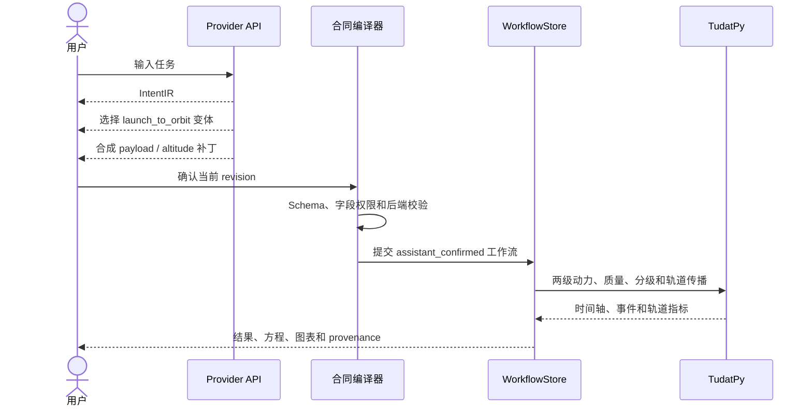

### 9.2 操作

1. 打开 **AI 编译**；
2. 新建会话；
3. 输入上述句子；
4. 检查意图、能力选择、参数补丁和假设；
5. 确认没有能力缺口或未映射要求；
6. 点击 **确认合同并执行**；
7. 等待工作流状态变为 **已完成**。

真实合同草案：

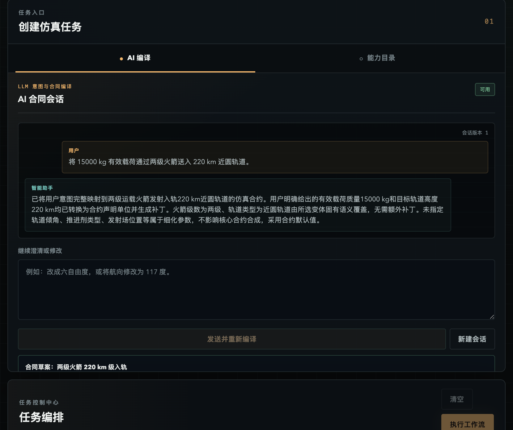

注册变体：

```text
family_id:  launch_to_orbit
variant_id: two_stage_220km_reference
```

参数补丁：

```text
vehicle.payload_mass_kg = 15000
target_orbit.altitude_m = 220000
```

### 9.3 真实结果

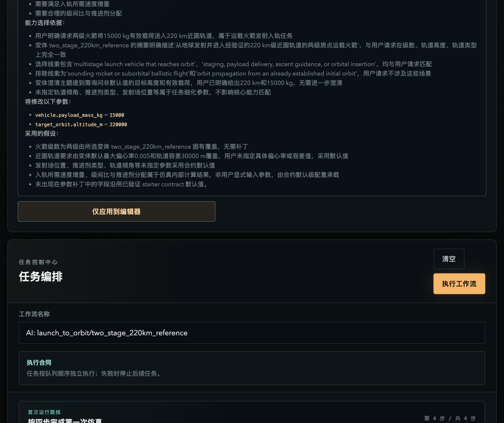

| 指标 | 结果 |
|---|---:|
| 有效载荷 | 15,000 kg |
| 轨道注入 | 405 s |
| 注入近地点 | 219,814.26 m |
| 注入远地点 | 226,114.91 m |
| 偏心率 | 0.00047724 |
| 质量闭合误差 | `1.30e-9 kg` |
| 入轨后验证 | 1,200 s |

| 发射剖面 | 轨道验证 |
|---|---|
| 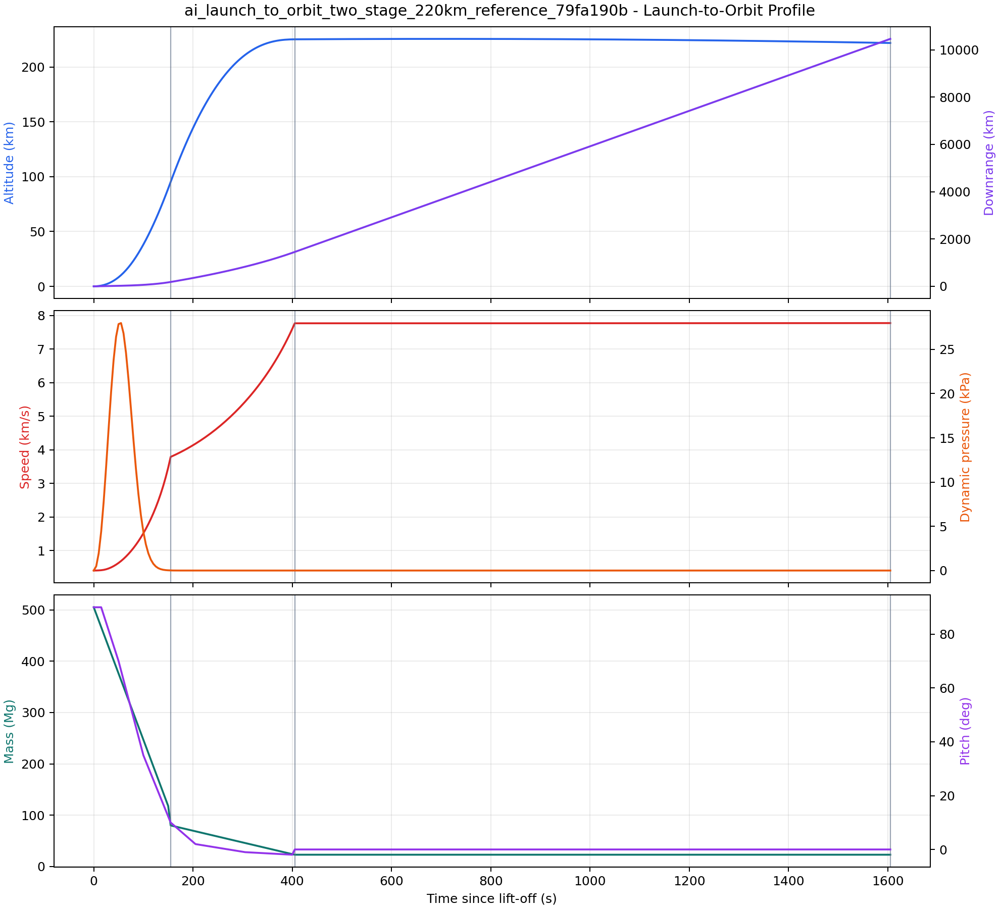 | 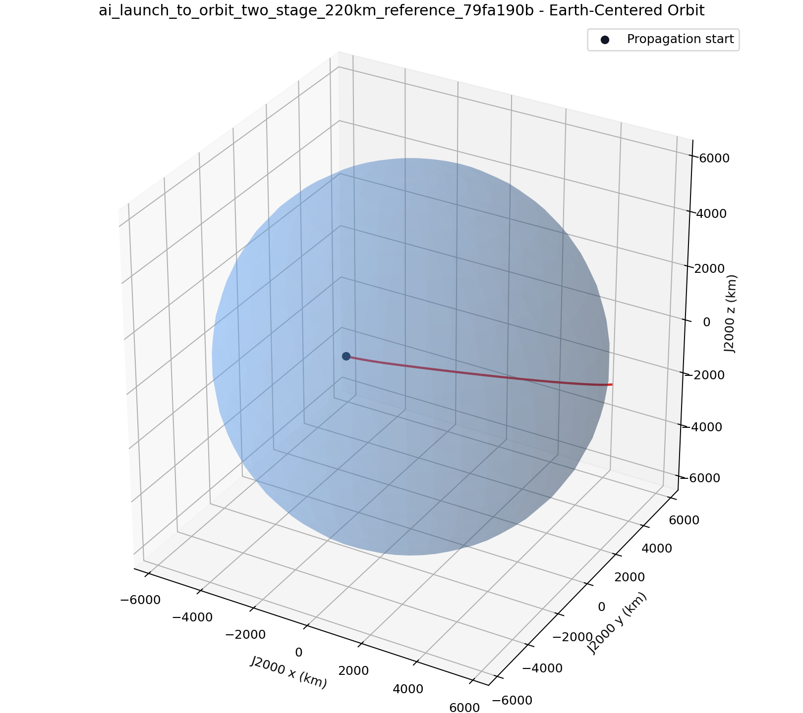 |

必须出现：

```text
backend_id = tudatpy
diagnostic = backend_contract_executed
diagnostic = target_orbit_verified
```

任一近地点、远地点、偏心率、质量或入轨后传播验收失败，任务都会失败。

事件顺序：

```text
0 s      liftoff
155 s    stage_1_burnout
155 s    stage_1_separation
155 s    stage_2_ignition
405 s    stage_2_burnout
405 s    orbital_insertion
1605 s   orbit_verification_end
```

判断它不是“伪成功”的依据：

- 初始状态位于真实发射场，不是预设在轨状态；
- 一级和二级都执行 TudatPy 平动与质量联合传播；
- 质量随推进剂消耗单调不增；
- 一级分离产生显式质量跃变；
- 最终质量等于有效载荷加上面级干质量；
- 轨道根数由真实注入笛卡尔状态计算；
- 入轨后继续无动力传播 1200 秒；
- 不存在 starter orbit 或预生成轨迹回退；
- 结果来源是 `assistant_confirmed`，并记录 draft、Provider 和请求哈希。

## 10. Demo 6：不用 LLM 手动运行火箭

1. 选择 **能力目录**；
2. 点击 **火箭飞行**；
3. 保持 `point_mass_3dof`；
4. 检查标记为“推荐调整”的参数；
5. 点击 **仅校验参数**；
6. 点击 **校验并添加到工作流**；
7. 点击 **执行工作流**；
8. 打开 **运行结果**。

默认真实 RocketPy 结果：

| 指标 | 结果 |
|---|---:|
| 离轨速度 | 22.64 m/s |
| 燃尽时间 | 3.00 s |
| 最高点 | 760.71 m AGL |
| 最大速度 | 139.39 m/s |
| 飞行时间 | 25.28 s |

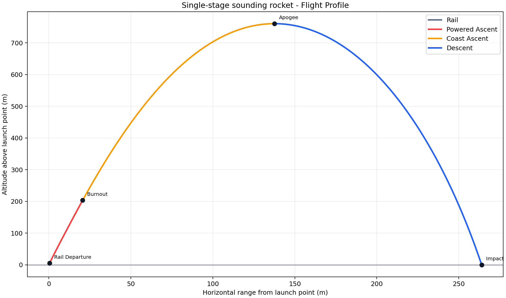

四个火箭变体的选择建议：

| 变体 | 何时使用 | 额外关注 |
|---|---|---|
| `point_mass_3dof` | 只关心飞行轨迹和主要事件 | 高度、速度、动压和落点 |
| `point_mass_3dof_recovery` | 需要快速验证降落伞下降 | 触发、部署延时和撞击速度 |
| `rigid_body_6dof` | 需要姿态和角速度 | 四元数范数、迎角和气动力矩 |
| `rigid_body_6dof_recovery` | 需要六自由度上升与回收 | 模型切换、双伞事件和着陆速度 |

不支持的字段不会被丢弃后按简化模型执行。

回收任务应出现：

```text
drogue_trigger
drogue_deployment
main_trigger
main_deployment
impact
```

参考双伞任务要求撞击速度低于 `10 m/s`。六自由度任务必须产生可测量的姿态和
角速度变化，并保持四元数范数接近 1。

## 11. Demo 7：运行轨道、飞机和航天器任务

### 11.1 TudatPy J2

示例：

```text
earth_orbit_j2_demo
```

观察升交点赤经、半长轴、偏心率、比能和角动量变化。

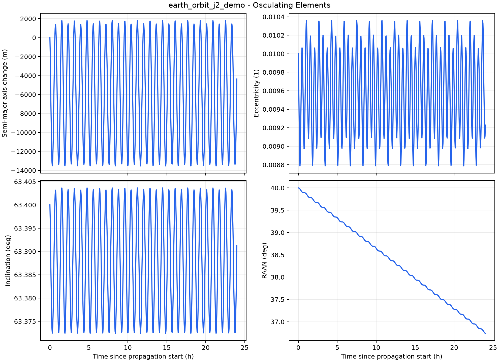

三个轨道变体：

| 变体 | 力模型 | 关键判据 |
|---|---|---|
| `earth_two_body` | 点质量地球 | 比能和角动量守恒 |
| `earth_j2` | 点质量加 J2 | 升交点回归与短周期根数变化 |
| `earth_j2_aerodynamic_drag` | J2 加旋转指数大气阻力 | 能量损失和半长轴下降 |

### 11.2 JSBSim C172P 副翼脉冲

示例：

```text
c172p_aileron_pulse_demo
```

真实最大滚转约 `7.99 deg`，并产生姿态、空速、高度和控制面响应。

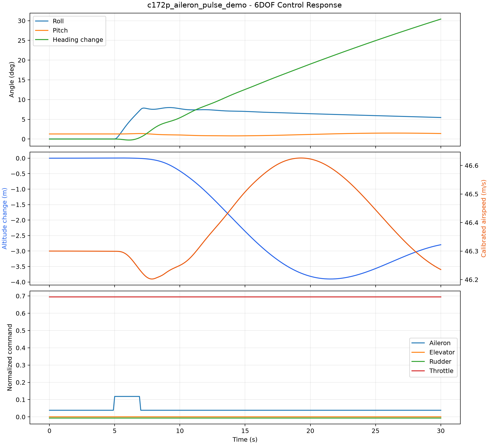

五种飞机 starter：

| 变体 | 飞机 | 用途 |
|---|---|---|
| `c172p_trimmed_6dof` | Cessna 172P | 单发通航机基线和副翼脉冲 |
| `c172r_trimmed_6dof` | Cessna 172R | 另一 C172 配平基线 |
| `c182_trimmed_6dof` | Cessna 182 | 更高性能单发通航机 |
| `c310_trimmed_6dof` | Cessna 310 | 双发固定翼 |
| `j3cub_trimmed_6dof` | Piper J3 Cub | 轻型低速飞机 |

所有飞机任务先校验配平状态，再执行相对配平控制时序。系统不会用 C172P 模型
冒充其他机型。

### 11.3 Basilisk 惯性姿态指向

示例：

```text
spacecraft_attitude_gnc_demo
```

| 指标 | 结果 |
|---|---:|
| 初始姿态误差范数 | 0.37417 |
| 最终姿态误差范数 | 0.000601 |
| 最终角速度误差 | `5.21e-5 rad/s` |
| 最大轮电机力矩 | `0.2 N m` |

| 姿态控制 | 反作用轮 |
|---|---|
| 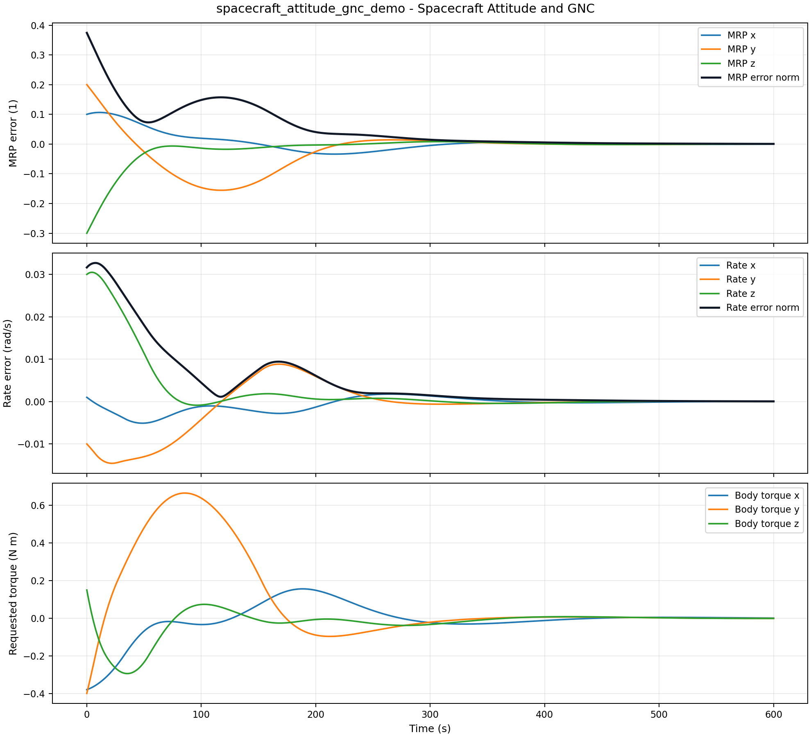 | 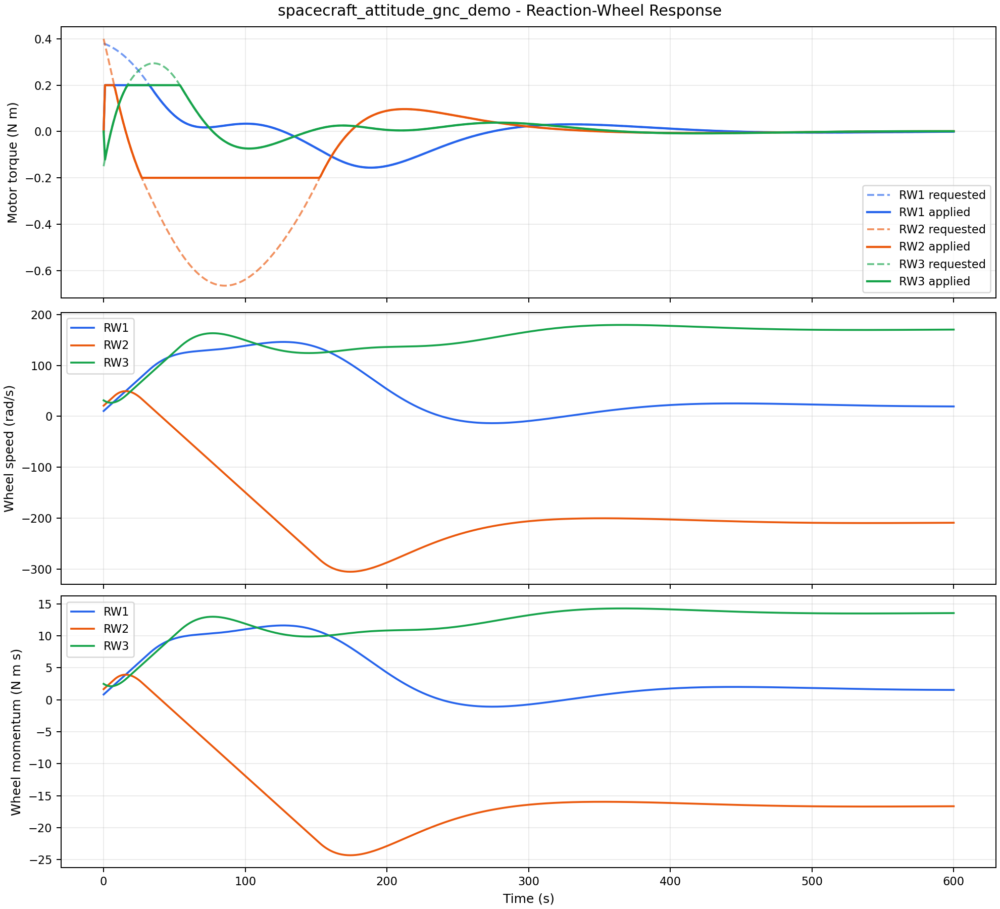 |

三个航天器变体：

| 变体 | 控制目标 | 验收重点 |
|---|---|---|
| `inertial_pointing_rw` | MRP 惯性姿态指向 | 姿态和角速度误差收敛 |
| `uncontrolled_attitude_rw` | 无控制对照 | 不应获得等价收敛 |
| `reaction_wheel_rate_damping` | 仅角速度阻尼 | 角速度下降，不声明姿态保持 |

## 12. Demo 8：查看动力学方程

结果页点击 **模型与方程**。

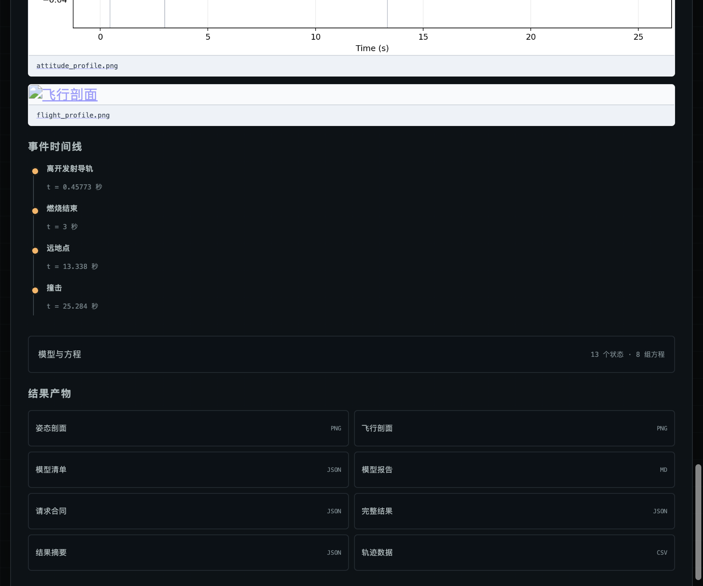

面板和产物显示：

- 状态名称、单位、坐标系和初值；
- 平动、转动、姿态和质量方程；
- 引力、大气、阻力、推力和控制闭合；
- 事件和终止条件；
- 质量、惯量、气动和求解器参数；
- 后端版本、假设、局限和实现引用。

机器可读：

```text
model_manifest.json
```

人类可读：

```text
model_report.md
```

方程是对固定版本运行实现的维护型文档投影，不宣称从第三方代码自动符号提取。

## 13. Demo 9：导出和重放工作流

### 13.1 导出

任务完成或失败后点击 **导出工作流**。

文件：

```text
workflow-{workflow_id}.json
```

Schema：

```text
wms.aerospace.workflow.v1
```

包含原始合同、顺序、handover 和来源 provenance，不包含可冒充重新执行的旧
运行结果。

### 13.2 重放

1. 清空当前队列；
2. 点击 **重放工作流**；
3. 选择导出的 JSON；
4. 系统重新校验全部合同和依赖；
5. 显式提交 `confirmed=true`；
6. 创建新的 workflow ID；
7. 真实后端重新执行。

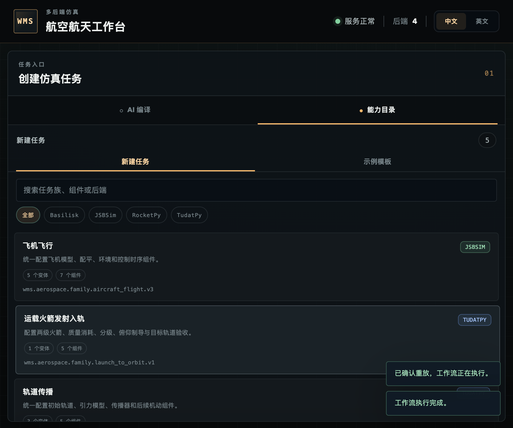

重放 provenance：

```json
{
  "origin": "workflow_replay",
  "workflow_schema": "wms.aerospace.workflow.v1",
  "source_workflow_id": "<original-workflow-id>"
}
```

导出内容保存：

- 工作流名称；
- 原始任务顺序；
- 每个任务最初提交的合同；
- 原始 handover 依赖和事件；
- 来源工作流 ID；
- 来源 provenance。

运行时 handover 修改后的请求不会覆盖原始目标合同，否则重放会重复应用状态
转换。重放会创建新的工作流和产物目录，绝不复用旧 `result.json`。

API 级别必须提交：

```json
{
  "workflow": {
    "workflow_schema": "wms.aerospace.workflow.v1",
    "source_workflow_id": "<source-id>",
    "name": "Replay demo",
    "tasks": []
  },
  "confirmed": true
}
```

实际 `tasks` 不能为空；示例省略任务内容只是为了突出确认字段。
`confirmed=false` 或缺失确认字段会得到 `422`。

## 14. Demo 10：RocketPy 到 TudatPy 状态交接


步骤：

1. 添加 RocketPy 任务；
2. 添加 TudatPy 轨道任务；
3. 在后者中指定前置任务和交接事件；
4. 指定发射历元；
5. 执行并检查 handover provenance。

默认探空火箭不能入轨时，系统会因无效近地点或轨道能量失败，不会换成预置
在轨状态。

## 15. Assistant 多轮修改与显式执行

### 15.1 三个 LLM 节点

`IntentInterpreter` 输出 `IntentIR`：

- 任务摘要；
- 领域提示、实体和目标；
- 有用户原文证据的显式要求；
- 带理由和置信度的推断要求；
- 排除项；
- 请求输出；
- 仍需澄清的歧义。

`CapabilityMatcher` 比较完整注册能力目录并返回：

```text
selected
needs_clarification
unsupported
```

`selected` 必须给出唯一注册 `family_id/variant_id`、决策证据且无能力缺口。
`needs_clarification` 必须给出问题。`unsupported` 必须给出具体能力缺口，不能
回退到“最接近”的任务。

`ContractSynthesizer` 基于选中的 starter 合同返回：

- grounded 参数补丁；
- 每个补丁对应的用户原文；
- 假设；
- 已映射要求；
- 未映射要求；
- 澄清问题。

只要存在未映射的实质要求，就不能形成可执行 proposal。

### 15.2 确定性编译边界

LLM 输出进入物理系统前必须经过：

1. 从注册 starter 深复制合同；
2. 拒绝修改 `schema_version`、`backend`、`dynamics` 和变体选择字段；
3. 拒绝未知、重复、类型变化、非有限或无法追溯的补丁；
4. 要求 `source_text` 是用户原文的字面子串；
5. 使用 `request_from_document()` 解析完整合同；
6. 通过 TaskFamilyRegistry 重新识别变体；
7. 通过 BackendRegistry 精确选择真实后端。

LLM 不能跳过其中任何一步。

### 15.3 多轮会话

DraftSession 支持：

- 最多 20 个用户轮次；
- 1 小时不活动过期；
- 每轮 `revision`；
- 后续自然语言覆盖冲突旧要求；
- 失败时回滚当前轮次；
- 乐观修订号防并发覆盖；
- 同一草案只能确认执行一次。

执行请求：

```json
{
  "expected_revision": 3,
  "confirmed": true
}
```

旧 revision、重复执行或 `confirmed` 不是 `true` 会被拒绝。

会话创建：

```json
{
  "prompt": "模拟一枚火箭",
  "locale": "zh-CN"
}
```

继续澄清或修改：

```json
{
  "message": "改成六自由度，航向 117 度",
  "expected_revision": 1
}
```

后续用户指令覆盖冲突的旧指令，但每轮都从注册 starter 重新构建，避免切换变体
后遗留旧字段。

### 15.4 Assistant HTTP 状态

| 状态 | 含义 |
|---:|---|
| `200` | proposal、需要澄清或明确不支持 |
| `404` | DraftSession 不存在或已过期 |
| `409` | revision 过期、并发修改或重复执行 |
| `422` | LLM 输出或编译合同违反确定性规则 |
| `502` | 已配置 Provider 请求失败 |
| `503` | 没有配置 Provider |

## 16. 结果和审计产物

### 16.1 统一请求协议

所有物理后端接收同一 `SimulationRequest` 外壳：

```json
{
  "protocol_version": 1,
  "request_id": "example-request",
  "label": "Example task",
  "description": "Human-readable purpose",
  "backend_preference": "rocketpy",
  "task_kind": "single_stage_point_mass_3dof",
  "contract_schema": "wms.aerospace.scenario.v1",
  "contract": {
    "schema_version": 1
  }
}
```

关键语义：

- `protocol_version` 固定协议边界；
- `request_id` 标识一次任务请求；
- `backend_preference` 指定期望后端；
- `task_kind` 标识动力学任务；
- `contract_schema` 标识强类型合同；
- `contract` 必须通过对应的完整合同 Schema。

后端原生对象不会穿过该边界。

### 16.2 统一结果协议

`UnifiedSimulationResult` 包含：

| 字段 | 含义 |
|---|---|
| `protocol_version` | 统一协议版本 |
| `request` | 实际执行请求 |
| `backend` | 后端 ID、名称、版本和能力 |
| `time_s` | 严格单调的共享时间轴 |
| `channels` | 带物理量、单位和坐标系的状态通道 |
| `events` | 事件名称、时刻和属性 |
| `metrics` | 名称、数值和单位 |
| `diagnostics` | 后端执行和物理验收诊断 |
| `model_manifest` | 状态、方程、参数、假设和来源 |

每个通道必须声明：

```text
name
physical_quantity
unit
frame
values
```

未知单位、时间长度不一致或非单调时间轴会在协议层失败。

### 16.3 通用产物

| 文件 | 内容 |
|---|---|
| `request.json` | 实际执行的规范化请求 |
| `result.json` | 完整时间轴、通道、指标、事件和诊断 |
| `summary.json` | 不包含大体量状态采样的摘要 |
| `trajectory.csv` | 带单位的时间序列 |
| `model_manifest.json` | 结构化状态、方程、参数和来源 |
| `model_report.md` | 可读动力学报告 |

### 16.4 任务特定图表

| 图表 | 任务 |
|---|---|
| `flight_profile.png` | 火箭高度与水平距离 |
| `attitude_profile.png` | 火箭姿态、迎角和角速度 |
| `recovery_profile.png` | 降落伞高度、垂直速度和部署事件 |
| `launch_profile.png` | 两级发射高度、速度、质量和动压 |
| `orbit_profile.png` | 地心 J2000 三维轨迹 |
| `orbital_elements.png` | 半长轴、偏心率、倾角和 RAAN |
| `aircraft_path.png` | 飞机局部三维航迹 |
| `aircraft_response.png` | 姿态、空速、高度和控制响应 |
| `spacecraft_attitude.png` | MRP 误差、角速度误差和控制力矩 |
| `reaction_wheel_response.png` | 轮力矩、轮速和角动量 |

### 16.5 Assistant 来源产物

Assistant 确认任务额外产生：

```text
assistant_provenance.json
```

其中记录：

- Provider profile；
- 模型 ID；
- prompt 版本；
- Assistant session、revision 和 draft；
- 任务族和变体；
- 实际执行请求的 SHA-256。

API 密钥和鉴权 Header 值不会进入 provenance。

`request_sha256` 对规范化请求执行排序、无空白 JSON 编码后计算，因此可以验证
磁盘请求是否与当时提交给后端的合同一致。

## 17. 常用 API

| 方法 | 路径 | 用途 |
|---|---|---|
| `GET` | `/api/health` | 应用和协议版本 |
| `GET` | `/api/capabilities` | 物理后端能力 |
| `GET` | `/api/parameter-definitions` | 参数定义 |
| `GET` | `/api/task-families` | 五个任务族和变体摘要 |
| `GET` | `/api/task-families/{family_id}` | 完整任务族、组件和 starter |
| `GET` | `/api/task-families/{family_id}/schema` | 任务族 JSON Schema |
| `GET` | `/api/scenarios` | 17 个参考场景 |
| `GET` | `/api/scenarios/{scenario_id}` | 单个参考合同 |
| `GET` | `/api/assistant/status` | Provider 状态 |
| `POST` | `/api/assistant/drafts` | 无状态单次合同编译 |
| `POST` | `/api/assistant/sessions` | 创建自然语言会话 |
| `GET` | `/api/assistant/sessions/{id}` | 查询当前 revision |
| `POST` | `/api/assistant/sessions/{id}/turns` | 澄清或修改 |
| `POST` | `/api/assistant/sessions/{id}/executions` | 确认执行 |
| `DELETE` | `/api/assistant/sessions/{id}` | 按 revision 删除会话 |
| `POST` | `/api/validate` | 校验任务 |
| `POST` | `/api/workflows` | 提交工作流 |
| `GET` | `/api/workflows/{id}` | 查询状态 |
| `GET` | `/api/workflows/{id}/export` | 导出工作流 |
| `POST` | `/api/workflow-replays` | 显式重放 |
| `GET` | `/api/workflows/{id}/tasks/{task_id}/artifacts/{name}` | 下载产物 |

OpenAPI：

```text
http://127.0.0.1:8000/api/docs
```

校验任务：

```json
{
  "document": {
    "protocol_version": 1,
    "request_id": "demo",
    "label": "Demo",
    "description": "Manual validation demo",
    "backend_preference": "rocketpy",
    "task_kind": "single_stage_point_mass_3dof",
    "contract_schema": "wms.aerospace.scenario.v1",
    "contract": {
      "schema_version": 1
    }
  }
}
```

这里的最小 `contract` 仅展示外壳；真实请求应使用任务族返回的完整 starter
`contract`，否则会得到 `422`。

工作流提交外壳：

```json
{
  "name": "Public release demo",
  "tasks": [
    {
      "task_id": "task-1",
      "document": {
        "protocol_version": 1
      },
      "handover": null
    }
  ]
}
```

同样需要把 `document` 替换为完整强类型请求。提交成功返回 `202`，随后通过
workflow ID 轮询。

## 18. CLI 示例

Provider：

```bash
xaerospace web \
  --provider-config config/providers.local.json \
  --provider-profile previous_glm
```

Assistant 评测：

```bash
xaerospace assistant-eval \
  --provider-profile previous_glm \
  --concurrency 1 \
  --output outputs/provider-evaluation.json
```

直接物理仿真：

```bash
xaerospace simulate scenarios/single_stage_demo.json \
  --output outputs/single_stage_demo

xaerospace simulate scenarios/single_stage_6dof_demo.json \
  --output outputs/single_stage_6dof

xaerospace simulate scenarios/single_stage_6dof_recovery_demo.json \
  --output outputs/single_stage_6dof_recovery

xaerospace simulate scenarios/two_stage_220km_launch_demo.json \
  --output outputs/two_stage_launch

xaerospace simulate scenarios/earth_orbit_two_body_demo.json \
  --output outputs/earth_orbit_two_body

xaerospace simulate scenarios/earth_orbit_j2_demo.json \
  --output outputs/earth_orbit_j2

xaerospace simulate scenarios/c172p_aileron_pulse_demo.json \
  --output outputs/c172p_response

xaerospace simulate scenarios/spacecraft_attitude_gnc_demo.json \
  --output outputs/spacecraft_gnc
```

规范化请求可以直接重放：

```bash
xaerospace simulate outputs/single_stage_demo/request.json \
  --output outputs/single_stage_replay
```

## 19. Provider Fail-closed

以下情况明确失败：

- 配置文件不存在、过大或不是合法 UTF-8 JSON；
- `schema_version` 不支持；
- `active_provider` 不存在；
- profile 名称或类型非法；
- URL 不是 HTTP(S) 或内嵌账号密码；
- 密钥环境变量缺失；
- 同时配置 Bearer 和自定义 Authorization；
- Header、路径、超时或并发范围非法；
- Provider 不可达或模型未发现；
- 结构化输出不符合完整 Schema；
- 连续失败触发熔断。

失败时不会：

- 切换到另一个 profile；
- 改用其他未选择的配置；
- 使用内建合同冒充 LLM 输出；
- 自动执行未确认草案。

## 20. 物理 Fail-closed

以下情况同样不会伪装成功：

- 合同字段、单位或质量闭合非法；
- 任务族、变体、组件或后端不匹配；
- 真实后端缺失或版本不一致；
- 上游工作流任务失败；
- handover 事件或转换状态无效；
- 发射入轨未通过近地点、远地点、偏心率和质量验收。

## 21. 已知限制

- 当前只内置 OpenAI-compatible Provider 类型；
- Provider 结构化生成必须支持 `strict` 或可使用 `llama_cpp` 兼容模式；
- 既有 GLM 服务仍有较高尾延迟和持续负载稳定性问题；
- Assistant 只能组合注册能力，不能创造新物理模型；
- DraftSession 和 WorkflowStore 尚未跨服务重启持久化；
- 发射任务使用预设俯仰程序，不是闭环制导；
- 本版本不用于认证或任务安全结论。

## 22. 故障排查

### 22.1 Provider 未配置

```bash
xaerospace web \
  --provider-config config/providers.local.json \
  --provider-profile <profile>
```

检查：

```bash
curl -s http://127.0.0.1:8000/api/assistant/status | jq
```

### 22.2 密钥变量缺失

错误会指出缺失的环境变量名称。设置该变量后重启服务，不要把真实值写入 JSON。

### 22.3 模型未被 `/models` 返回

检查：

- `base_url`；
- `models_path`；
- `model` 是否与 API 返回一致；
- 鉴权 Header 是否同时应用于模型发现接口。

### 22.4 API 不支持完整 JSON Schema

对 llama.cpp 兼容服务使用：

```json
{
  "compatibility_mode": "llama_cpp"
}
```

不要通过放松合同校验解决传输兼容问题。

### 22.5 手动任务正常但 Assistant 不可用

这是允许的隔离状态。Provider 故障不会阻止用户使用参数表单、JSON 合同和物理
后端。

### 22.6 TudatPy 任务失败，但其他后端正常

TudatPy 使用独立 Conda 环境。重新初始化：

```bash
xaerospace setup-tudatpy
```

然后检查：

```bash
curl -s http://127.0.0.1:8000/api/capabilities \
  | jq '.backends[] | select(.backend_id == "tudatpy")'
```

应报告 `TudatPy 1.0.0` 和轨道、发射入轨任务族。

### 22.7 无法重放工作流

检查：

- 当前前端队列必须为空；
- `workflow_schema` 必须是 `wms.aerospace.workflow.v1`；
- `tasks` 不能为空；
- 原始合同没有被手工改坏；
- handover 的 source task 排在目标任务之前；
- 请求包含字面量 `"confirmed": true`。

### 22.8 结果没有预期的物理效应

查看当前任务的 `component_ids` 和 `model_manifest.json`。没有显式启用的
第三体、J2、阻力、回收、控制器或扰动力不会自动加入。

例如：

- `earth_two_body` 不应出现 J2 回归；
- `earth_j2` 不应出现气动能量损失；
- `uncontrolled_attitude_rw` 不应获得受控姿态收敛；
- 无回收火箭不应生成降落伞事件。

### 22.9 Assistant 返回 `409`

重新获取会话，使用最新 `revision`。不要重试已经成功确认执行的 DraftSession；
新任务应创建新会话。

### 22.10 工作流失败后后续任务未运行

这是预期 Fail-closed 行为。先查看第一个失败任务的 `diagnostics` 和错误信息，
修复合同后提交新工作流。系统不会跳过失败任务继续执行依赖链。
